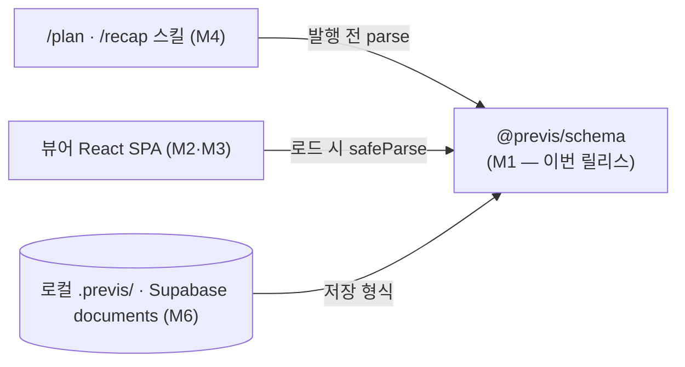

# Tutorial v0.2.0 — 블록 스키마 계약 설계: zod 4 판별 유니온과 재귀 문서 검증

> 대상: previs M1 (`@previs/schema`). 이 릴리스의 핵심 원리인 "스키마를 모든
> 계층의 계약으로 먼저 고정한다"를 내부 동작 수준까지 해설한다.

## 1. 왜 스키마가 첫 릴리스인가

previs의 모든 계층은 하나의 데이터 구조를 주고받는다: **블록 JSON 문서**.



스키마가 흔들리면 세 계층이 동시에 흔들린다. 그래서 M1은 렌더러도 스킬도
없이 **계약만** 고정한다. 이 순서가 주는 실질적 이득:

- 뷰어(M2)는 "스키마를 통과한 문서"만 다루면 되므로 렌더러에서 방어 코드가
  사라진다.
- 스킬(M4)은 발행 전에 `parsePrevisDocument`로 검증해 잘못된 문서가
  저장소에 남는 것 자체를 차단한다.
- 협업 테이블(M6)은 envelope의 `schemaVersion`·`kind`를 최상위 컬럼으로
  그대로 승격할 수 있다.

## 2. 판별 유니온(discriminated union)의 선택

블록은 `type` 필드 하나로 12종이 갈린다. zod의 일반 `z.union`은 모든 멤버를
순차 시도하지만, `z.discriminatedUnion('type', [...])`은 판별자 값을 먼저
읽어 해당 멤버 스키마 **하나만** 검사한다.

```ts
// packages/schema/src/block.ts
export const blockSchema: z.ZodType<Block> = z.lazy(() =>
  z.discriminatedUnion('type', [
    proseSchema,
    calloutSchema,
    // ... 12종
  ]),
);
```

두 가지 효과가 있다:

1. **에러 품질** — `type: 'prose'`인 블록이 실패하면 prose 스키마의 이슈만
   보고된다. 일반 union이라면 12개 멤버 전부의 실패 사유가 뒤섞인다.
2. **성능** — 12종을 전부 시도하지 않고 O(1)로 멤버를 선택한다. 문서당
   블록 수가 늘어도 검증 비용이 타입 수에 비례하지 않는다.

zod 4에서 주목할 내부 변화: `refine`/`superRefine`이 별도 래퍼(ZodEffects)가
아니라 스키마 내부 check로 저장된다. 그래서 `annotated-code`처럼
`superRefine`이 붙은 객체 스키마도 판별 유니온의 멤버가 될 수 있다
(zod 3에서는 불가능했던 조합이다).

## 3. 재귀 컨테이너와 순환 참조 끊기

`tabs`·`columns`는 `blocks: Block[]`를 중첩 포함한다. 타입과 모듈 두 수준에서
순환이 생긴다.

**모듈 순환**: `block.ts` → `tabs.ts` → `block.ts`. ESM은 순환 import 시
아직 초기화되지 않은 바인딩을 참조할 수 있는데, `z.lazy(() => blockSchema)`가
평가를 **파싱 시점**으로 미뤄 초기화 순서 문제를 피한다.

```ts
// packages/schema/src/blocks/tabs.ts
const nestedBlockSchema: z.ZodType<Block> = z.lazy(() => blockSchema);
```

**타입 순환**: 재귀 타입은 `z.infer`로 추론할 수 없다. TypeScript가 순환
타입의 고정점을 스스로 찾지 못하기 때문에, 컨테이너 블록만은 interface를
손으로 선언하고 스키마에 `z.ZodType<T>` 어노테이션으로 연결한다.

```ts
export interface TabsBlock {
  id: string;
  type: 'tabs';
  items: TabsItem[]; // TabsItem.blocks: Block[] — 여기서 재귀
}
```

leaf 블록 10종은 전부 `z.infer`로 추론한다. 손 선언은 재귀가 강제하는
곳에만 국한해 스키마·타입 이원화의 표면적을 최소로 유지한다.

## 4. 블록 검증 vs 문서 검증 — 두 층의 분리

개별 블록 스키마는 "블록 하나가 그 자체로 올바른가"만 본다. 문서 전체에서만
판단 가능한 불변식은 envelope의 `superRefine`에서 트리 순회로 검사한다.

```ts
// packages/schema/src/document.ts
export const previsDocumentSchema = documentSchema.superRefine((document, context) => {
  walkBlocks(document.blocks, 0, new Set<string>(), context, ['blocks']);
});
```

여기서 검사하는 두 불변식:

- **블록 id 전역 유일성** — 코멘트 앵커(M6)의 전제. 중첩 블록까지 포함해
  문서 내 모든 id가 유일해야, 코멘트가 가리키는 블록이 모호해지지 않는다.
- **컨테이너 중첩 깊이 ≤ 4** — 렌더러(M2)의 재귀 렌더링이 악성/실수 입력으로
  무한히 깊어지는 것을 데이터 계층에서 차단한다. 렌더러가 아니라 스키마가
  막는 이유: 뷰어가 여러 개(로컬/협업)여도 규칙이 한 곳에 산다.

`walkBlocks`는 이슈를 발견해도 순회를 멈추지 않는다. zod의 `ctx.addIssue`
누적 방식 덕에 "id 중복 3건 + 깊이 초과 1건"을 한 번의 파싱으로 전부
보고할 수 있다 — 에이전트가 문서를 수정할 때 왕복 횟수를 줄인다.

경계 사례: 깊이 검사는 `path`를 이슈에 붙여 어느 중첩 지점이 초과했는지
정확히 가리킨다. `blocks[3].items[0].blocks[2]` 같은 경로가 그대로 에러에
남는다.

## 5. additive 진화와 `schemaVersion`

envelope의 `schemaVersion: z.literal(1)`은 단순한 상수가 아니라 진화 전략의
축이다 (AGENTS.md 데이터 규칙: 파괴적 변경 금지).

- **필드 추가**(additive)는 기존 문서를 깨지 않는다 — optional 필드로만
  추가하면 version 1 그대로 수용 가능.
- **의미가 바뀌는 변경**은 `z.literal(1)`을 `z.union([z.literal(1), z.literal(2)])`
  로 넓히고 버전별 분기 파서를 둔다. 알 수 없는 미래 버전 문서는 명시적으로
  파싱 실패한다 — 조용히 잘못 렌더링되는 것보다 낫다.
- 알 수 없는 블록 `type`도 같은 원리로 거부한다. 전방 호환은 "무시하고
  통과"가 아니라 "버전 상승"으로 다룬다.

## 6. 빌드 전략 — NodeNext와 이중 소비자

`@previs/schema`는 두 부류의 소비자를 가진다: Vite 번들러(뷰어)와 Node
런타임(스킬·런처). plain `tsc`로 ESM + `.d.ts`를 `dist/`에 내는 이유다.

- 소스의 상대 import는 전부 `./x.js` 확장자를 쓴다(NodeNext 요구).
  tsc는 이를 재작성하지 않으므로 산출물이 Node ESM에서 그대로 동작한다.
- `tsconfig.json`(typecheck: 테스트 포함) / `tsconfig.build.json`(emit:
  테스트 제외)을 분리했다. 하나의 설정으로 겸하면 테스트가 `dist/`에
  섞여 배포물을 오염시킨다.
- `src/dist.test.ts`는 빌드 산출물을 **실제 Node ESM 해석으로** import해
  exports 맵 오타·확장자 누락 같은 "typecheck는 통과하지만 런타임에 깨지는"
  회귀를 잡는다. 그래서 루트 `pnpm test`는 빌드를 선행한다.

## 7. 이번 사이클에서 만난 엣지 케이스

실제로 부딪힌 문제들 — 다음 마일스톤에서 같은 함정을 밟지 않기 위한 기록.

1. **TypeScript 6은 `node_modules/@types`를 자동 포함하지 않는다.**
   `import 'node:fs/promises'`가 TS2591로 실패했고, `@types/node`를 패키지에
   설치하는 것만으로는 부족했다. `tsconfig`에 `"types": ["node"]`를 명시해야
   한다. TS 5 프로젝트 경험으로 옮겨 오면 반드시 걸리는 변화다.
2. **TypeScript 7.0은 아직 typescript-eslint 지원 범위 밖** (`<6.1.0`).
   최신 메이저를 반사적으로 선택하지 않고 `npm view`로 peer 범위를 확인해
   6.0.3으로 고정했다. 지원 확장 시 상향한다.
3. **`engines.node`는 의존성의 engines와 정합해야 한다.** ESLint 10이
   `^20.19.0 || ^22.13.0 || >=24`를 요구하므로 previs의 `>=22` 선언은
   22.0~22.12에서 설치 실패를 허용하는 거짓 약속이었다. `^22.13.0 || >=24`로
   좁혔다.
4. **픽스처도 Grounding Rule을 따른다.** 샘플 recap이 실제 브랜치를 recap
   한다고 명시하는 순간, diff 발췌는 실제 소스 라인이어야 한다. "예시니까"
   라는 이유로 지어낸 코드를 넣으면, 픽스처가 M4 스킬의 본보기가 되는 순간
   위반 사례를 학습시키는 셈이 된다.

## 8. 정리

| 결정 | 근거 |
|------|------|
| 판별 유니온 + `z.lazy` | 에러 품질·O(1) 멤버 선택·재귀 컨테이너 지원 |
| 문서 레벨 `superRefine` | 전역 불변식(id 유일성·깊이)은 블록 단독으로 판단 불가 |
| `schemaVersion` literal | additive 진화 축, 미래 버전 명시적 거부 |
| typecheck/build tsconfig 분리 | 테스트의 dist 오염 방지 |
| dist ESM smoke test | exports 맵·ESM 해석 회귀를 런타임 수준에서 검증 |

다음 사이클(M2 뷰어)은 이 계약 위에서 시작한다: 렌더러는
`safeParsePrevisDocument`가 통과시킨 문서만 렌더링하며, 실패 시 에러 UI로
분기한다.
