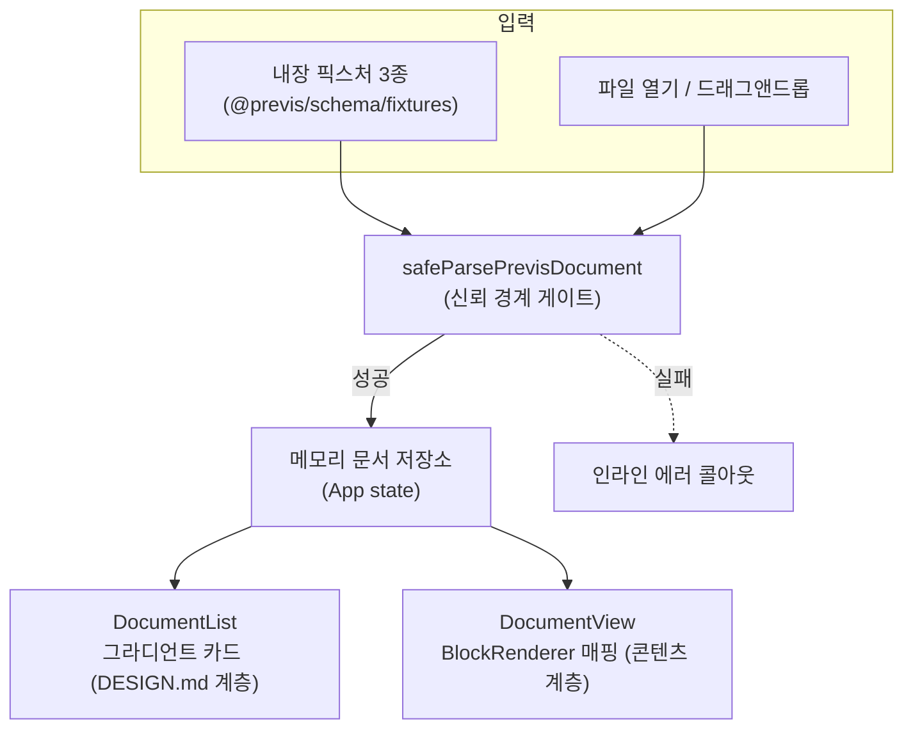

# Tutorial v0.3.0 — 뷰어 MVP: 이중 시각 체계와 신뢰 경계, 그리고 렌더링 함정들

> 대상: previs M2 (`apps/viewer`). 이 릴리스의 핵심 원리 — "뷰어는 검증된
> 문서만 렌더링하고, 앱 크롬과 블록 콘텐츠의 시각 체계를 분리한다" — 를
> 구현 결정과 실제로 부딪힌 함정 중심으로 해설한다.

## 1. 아키텍처 한눈에



모든 문서는 출처와 무관하게 `safeParsePrevisDocument`를 통과해야 저장소에
들어간다. 렌더러는 "스키마를 통과한 문서"라는 전제 위에서만 동작하므로
블록 컴포넌트에는 방어 코드가 없다 — M1에서 계약을 먼저 고정한 효과가
여기서 실현된다.

## 2. 디자인 토큰 2계층 — 라이트/다크를 CSS 변수로

DESIGN.md(MiniMax 분석)는 라이트 전용이다. 구현은 **raw 변수 → semantic
토큰** 2계층으로 풀었다:

```css
:root  { --canvas: #ffffff; --ink: #0a0a0a; /* DESIGN.md 원값 */ }
.dark  { --canvas: #101214; --ink: #f5f6f7; /* 자체 정의 다크 */ }

@theme inline {
  --color-canvas: var(--canvas);  /* Tailwind 유틸(bg-canvas 등) 생성 */
  --color-ink: var(--ink);
}
```

핵심은 `@theme inline`이다. Tailwind 4의 `@theme`은 기본적으로 토큰 값을
정적으로 굳히지만, `inline` 참조 방식은 `var(--canvas)`를 그대로 유틸에
넣어 **`.dark`에서 변수만 바꾸면 모든 유틸이 자동 반전**되게 한다.
컴포넌트는 `bg-canvas text-ink`만 쓰고 다크 분기를 전혀 모른다.

테마 전환은 `html.dark` 클래스 + `@custom-variant dark`로 연결되며,
초기값은 `prefers-color-scheme`, 사용자 선택은 localStorage에 남는다.

## 3. 시각 계층 분리 — 리뷰에서 실제로 걸린 규칙

previs의 원칙(ARCHI §5-3): 앱 크롬은 DESIGN.md 토큰, 블록 콘텐츠는 별도
체계. M2에서 이 경계가 실제로 침범됐다가 코드 리뷰에서 적발됐다 —
블록 렌더러가 `text-brand-blue`(파일 상태), `border-brand-blue/25`(콜아웃)
등 **브랜드 토큰을 콘텐츠에 사용**한 것.

해결: 콘텐츠 의미 토큰(`--info`/`--info-soft`)을 신설하고 상태 색을
success/info/danger/warning으로 통일했다. 브랜드 4색(coral·magenta·blue·
purple)은 문서 카드 식별색으로만 남는다. 교훈: 계층 규칙은 "어떤 토큰
이름을 쓸 수 있는가"로 기계적으로 검사 가능하다 — `grep brand-
components/blocks/`가 곧 위반 검사다.

## 4. 문서 카드 식별색 — 해시 분포의 함정

문서 id의 결정적 해시로 그라디언트를 배정하는데, 최초 구현(`h*31` 합산,
4버킷)은 내장 픽스처 3종이 **전부 같은 색**에 몰렸다. 4버킷에서 특정 3개
키가 모두 분리될 확률은 37.5%에 불과하다 — "일반 분포가 균등한 해시"와
"내 데이터가 분리되는 해시"는 다른 문제다.

개선: djb2-xor 해시 + 브랜드 팔레트 내 그라디언트 조합 8종으로 확장.
버킷을 늘려 충돌 확률을 낮추고, 내장 픽스처 3종의 분리를 테스트로
고정했다(해시를 바꾸면 테스트가 알려준다).

## 5. 라우팅 함정 — encodeURIComponent 왕복은 안전하지 않다

문서 id는 스키마상 임의 문자열이다(`%`, `/`, 유니코드 허용). 최초 구현은
`/doc/${encodeURIComponent(id)}` + `decodeURIComponent(param)`의 대칭
왕복을 가정했지만, 두 가지가 실측으로 깨졌다:

1. react-router의 `useParams`는 **이미 디코딩된 값**을 준다 — 우리가 한 번
   더 디코딩하면 `release-100%` 같은 id에서 `URIError`로 크래시.
2. 이중 디코딩을 제거해도, 리터럴 `%2F`를 포함한 id는 라우터의 경로
   정규화 과정에서 실제 `/`와 충돌해 **잘못된 문서로 매칭되거나 목록으로
   리다이렉트**된다. (jsdom + react-router 8 통합 테스트로 재현)

해결은 인코딩 규칙 맞추기가 아니라 **문제 자체의 제거**: base64url 불투명
라우트 키를 도입했다.

```ts
// route-key.ts — URL-safe 문자셋 [A-Za-z0-9_-]만 남는다
documentRouteKey('feature%2Fviewer'); // 'ZmVhdHVyZSUyRnZpZXdlcg'
```

조회는 `documentRouteKey(entry.id) === param`처럼 **인코딩된 값끼리 비교**
하므로 디코딩 경로가 아예 없다. URL 가독성을 잃는 대신 정확성을 얻는
트레이드오프 — 리뷰 도구에서 URL은 공유 수단이지 정보 표면이 아니므로
수용했다.

## 6. shiki 렌더링의 세 가지 함정

diff 블록은 shiki(`diff` 문법, github-light/dark 듀얼 테마)로 하이라이트
한다. 구현에서 만난 함정들:

1. **듀얼 테마는 CSS가 반이다.** `codeToHtml({ themes: { light, dark } })`는
   토큰마다 `--shiki-dark` 변수를 인라인으로 심을 뿐, 전환 CSS는 사용자가
   써야 한다: `.dark .shiki, .dark .shiki span { color: var(--shiki-dark) }`.
   이 스니펫이 없으면 다크에서 라이트 색이 그대로 남는다.
2. **`.line { display: block }`은 이중 행간을 만든다.** shiki 출력은 라인
   span 사이에 개행 문자를 포함하므로(`white-space: pre`), block 표시가
   더해지면 줄마다 빈 줄이 생긴다. `inline-block + width: 100%`로 전폭
   배경과 단일 행간을 동시에 얻었다.
3. **diff 행 분류는 헌크 문맥이 필요하다.** `+++`로 시작하는 행을 파일
   헤더로 일괄 제외하면, 내용이 `++counter;`인 추가 행(`+` + `++counter;`)
   까지 오분류된다. `@@` 헌크 추적으로 해결하되, 헌크 없는 발췌(excerpt)는
   전 행을 분류하는 이중 모드로 구현했다 — recap 발췌는 대부분 `@@` 없이
   온다는 previs 특성 반영. 분류는 순수 함수 `classifyDiffLines`로 추출해
   transformer를 실행하지 않는 테스트 mock의 사각지대를 제거했다.

성능: 하이라이터는 모듈 싱글턴 + dynamic import로 lazy 생성 — diff 블록이
없는 문서는 shiki를 로드하지 않는다.

## 7. 전방 호환 렌더링 — FallbackBlock

M2는 12종 중 6종만 렌더러가 있다. `BlockRenderer`의 매핑 테이블에 없는
타입은 FallbackBlock("이 블록은 M3에서 지원됩니다")으로 렌더링돼 문서
전체가 깨지지 않는다. 스키마가 알 수 없는 타입을 이미 거부하므로(M1),
fallback에 도달하는 것은 "유효하지만 아직 렌더러가 없는" 타입뿐이다 —
검증 계층과 렌더링 계층의 책임 분리가 명확해지는 지점이다.

## 8. 정리

| 결정/함정 | 요점 |
|-----------|------|
| `@theme inline` 2계층 토큰 | `.dark` 변수 교체만으로 전 유틸 반전 |
| 시각 계층 grep 검사 | 블록 콘텐츠에 `brand-*` 금지 — 기계적 검증 가능 |
| 해시 식별색 | 균등 분포 ≠ 내 데이터 분리. 버킷 확장 + 테스트 고정 |
| base64url 라우트 키 | 인코딩 왕복 규칙 대신 디코딩 경로 자체를 제거 |
| shiki 듀얼 테마/행간/행 분류 | CSS 스니펫 필수, block 표시 금지, 헌크 문맥 분류 |
| FallbackBlock | 검증(스키마)—렌더링(매핑) 책임 분리로 전방 호환 |

다음 사이클(M3)은 이 뷰어 위에 previs의 정체성인 `--wf-*` 손그림 계층
(wireframe + rough.js, mermaid, annotated-code, data-model, api-endpoint)을
올린다. FallbackBlock 6종이 하나씩 실제 렌더러로 교체된다.
