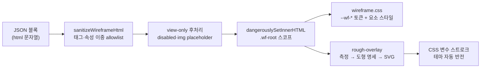

# Tutorial 0.3.1 — 와이어프레임 렌더러: 신뢰 경계 위에 손그림 계층 쌓기

이번 사이클은 previs의 정체성인 `--wf-*` 손그림 체계의 1차 구현이다.
겉보기에는 "HTML 조각을 예쁘게 그리는" 기능이지만, 내부적으로는 네 가지
설계 문제를 동시에 푼다: **두 번째 토큰 체계의 격리**, **신뢰 경계 밖 HTML의
sanitize 정책**, **결정적(deterministic) 스케치 오버레이**, 그리고 **lazy
청크의 실패 경로**. 각각을 원리부터 뜯어본다.

## 1. 렌더 파이프라인 전체 그림



핵심 순서: **정제 → 주입 → 스타일 → 오버레이**. 각 단계는 다음 단계가
신뢰할 수 있는 불변식을 만든다. sanitize가 "이 HTML에는 실행 경로·외부
요청·하드코딩 표현이 없다"를 보장하기 때문에, 이후 단계는 마음 놓고
`dangerouslySetInnerHTML`을 쓸 수 있다.

## 2. 두 번째 토큰 체계 — 왜 `--wf-*`를 따로 두는가

previs 뷰어에는 이미 DESIGN.md 기반 앱 크롬 토큰(`--canvas`, `--ink` 등)이
있다. 와이어프레임에 같은 토큰을 쓰면 안 되는 이유는 **의미가 다르기
때문**이다:

- 앱 크롬 토큰은 "previs라는 제품의 브랜드 룩"이다. 문서 목록, 버튼, 배지가
  이 값을 따른다.
- `--wf-*` 토큰은 "콘텐츠가 그려지는 종이의 룩"이다. 에이전트가 만든
  와이어프레임은 previs 브랜드가 아니라 중립적인 스케치북 위에 있어야 한다.

두 체계가 섞이면 테마를 조정할 때마다 서로를 깨뜨린다. 그래서
`wireframe.css`는 독립된 값 공간을 갖는다:

```css
:root {
  --wf-canvas: #f2eee8;  /* 종이 배경 — 앱 canvas(#fff)와 다른 값 */
  --wf-ink: #24313b;     /* 잉크 — 앱 ink(#0a0a0a)와 다른 값 */
}
.dark {
  --wf-canvas: #1d2226;
  --wf-ink: #edf1f2;
}
```

메커니즘은 앱 토큰과 동일하다(`html.dark` 클래스에서 값 재정의). **패턴은
공유하고 값은 격리한다** — 이것이 ARCHI §5의 "시각 계층 분리" 원칙이 코드로
나타나는 방식이다.

두 번째 결정은 **요소 셀렉터 스타일링**이다. `.wf-root` 스코프 안에서
`h1`, `section`, `button` 같은 시맨틱 태그에 직접 스타일을 입힌다:

```css
.wf-root button {
  border: 1px solid var(--wf-ink);
  background: color-mix(in srgb, var(--wf-accent) 16%, var(--wf-surface));
}
```

에이전트가 쓰는 HTML에는 클래스가 하나도 없다(sanitize가 class를 제거하기도
한다). 구조만 쓰면 룩은 렌더러가 입힌다 — AGENTS.md 콘텐츠 규칙의 "룩은
렌더러가 소유한다"가 강제되는 지점이 CSS 아키텍처 자체에 있는 것이다.

## 3. Sanitize — 기본 allowlist를 믿으면 안 되는 이유

DOMPurify는 `ALLOWED_TAGS`만 주면 나머지를 알아서 처리해 줄 것 같지만,
**속성은 별개의 축**이다. DOMPurify의 기본 속성 allowlist에는 `width`,
`height`, `src`, `href`, `action` 같은 표현·지오메트리·리소스 속성이
포함된다. 태그만 제한하면:

- `<table width="400">` — 콘텐츠 규칙(폭 하드코딩 금지)이 뚫린다.
- `` — 외부 요청이 나간다 (데이터 주권 위반).
- `<form action="/x">` — 제출 시 SPA가 리로드되어 메모리 문서가 날아간다.

그래서 정책은 **이중 allowlist**다:

```ts
const SANITIZE_CONFIG: Config = {
  ALLOWED_TAGS: [...],   // 시맨틱 구조·텍스트·폼 태그만
  ALLOWED_ATTR: [...],   // alt, colspan, for, placeholder 등 최소 셋
  ALLOW_DATA_ATTR: false // data-* 전면 차단
};
```

allowlist 방식의 장점은 **미래의 공격 벡터에 기본 안전**하다는 것이다.
blocklist는 새 속성이 표준에 추가될 때마다 구멍이 생기지만, allowlist는
명시하지 않은 것이 전부 제거된다.

sanitize 이후에도 두 겹의 방어가 더 있다:

1. **후처리**: 폼 컨트롤에 `disabled` 부여, ``를 alt 텍스트
   placeholder `<span>`으로 치환. DOM 파싱 기반 후처리라서 문자열 치환의
   함정(부분 매칭, 인코딩 우회)이 없다.
2. **React 위임 차단**: `.wf-root` 래퍼의 `onSubmit`/`onClick`에서 기본
   동작을 막는다. 클릭 차단은 `closest('a')`로 앵커에만 좁혔다 —
   `<details>/<summary>` 토글 같은 무해한 상호작용은 살리기 위해서다.
   (무차별 `preventDefault()`는 처음 구현에 있었고, self-review에서
   좁혀졌다. "가장 넓은 차단"이 항상 가장 안전한 것은 아니다 — 의도를
   정확히 표현하는 차단이 유지보수에서 안전하다.)

## 4. rough.js 오버레이 — 결정성과 무재그리기 테마 반전

손그림 스케치의 함정은 **랜덤성**이다. rough.js는 기본적으로 그릴 때마다
다른 흔들림을 만든다. 리렌더마다 테두리가 춤추면 검토 도구로는 실격이다.
해결은 시드 고정:

```ts
export function seedFromBlockId(blockId: string): number {
  let hash = 2166136261;            // FNV-1a offset basis
  for (const character of blockId) {
    hash ^= character.charCodeAt(0);
    hash = Math.imul(hash, 16777619); // FNV prime, 32bit 곱셈
  }
  return (hash >>> 0) & 0x7fffffff || 1; // 양수 보장, 0 회피
}
```

같은 블록 id는 언제나 같은 스케치를 만든다. 문서 카드 그라디언트 배정
(card-identity)과 같은 패턴 — **"랜덤해 보이지만 결정적"은 해시로 만든다**.

두 번째 문제는 테마 전환이다. 순진한 구현은 다크 모드 전환 시 오버레이를
다시 그린다(색이 바뀌니까). 여기서는 스트로크 색을 값이 아니라 **CSS 변수
참조**로 넘긴다:

```ts
renderer.rectangle(x, y, w, h, {
  stroke: 'var(--wf-ink)',
  fill: 'var(--wf-surface)',
});
```

SVG 속성에 담긴 `var()`는 CSS 커스텀 프로퍼티 시스템이 해석하므로,
`html.dark`가 토글되면 브라우저가 알아서 색을 반전한다. JS 재실행 없이.
재그리기는 **기하가 변할 때만**(ResizeObserver) 일어난다. 관심사가 정확히
갈린 것이다: 색은 CSS의 일, 좌표는 JS의 일.

마지막으로 겹침 문제 — 오버레이 SVG는 콘텐츠 위(z-index 2)에 얹히는데
solid fill이 텍스트를 가리지 않을까? CSS가 fill을 후처리한다:

```css
.wf-rough-frame path { fill: none; }              /* 프레임은 윤곽만 */
.wf-rough-element path[fill^='var('] { fill-opacity: 0.08; } /* 요소는 틴트 */
```

rough.js가 fill용 path와 stroke용 path를 분리 생성하는 내부 구조를
이용해, 속성 셀렉터로 fill path만 골라 투명도를 낮춘다.

## 5. React.lazy의 실패 경로 — Suspense가 못 잡는 것

wireframe 렌더러는 rough.js+DOMPurify를 포함하므로 `React.lazy`로 청크를
분리했다. 여기서 리뷰 루프가 두 번의 Major를 잡아냈고, 각각이 교훈이다.

**1라운드: Suspense는 로딩만 처리한다.** lazy import가 reject되면(청크
유실, 네트워크 단절) 그 에러는 Suspense가 아니라 **에러 바운더리**의
관할이다. 바운더리가 없으면 에러가 루트까지 전파되어 React가 트리 전체를
언마운트한다 — 열어 둔 메모리 문서가 화면에서 사라진다. 블록 하나의 실패가
문서 전체를 죽이면 안 되므로, 바운더리를 **블록 단위**에 세운다:

```tsx
<WireframeErrorBoundary>      {/* 실패 격리 지점 */}
  <Suspense fallback={<WireframeLoadingFallback />}>
    <LazyWireframeBlock block={block} />
  </Suspense>
</WireframeErrorBoundary>
```

**2라운드: 재시도 버튼은 거짓말이었다.** 첫 수정은 "다시 시도" 버튼이 새
`lazy()` 인스턴스를 만들어 재시도했다. 그러나 브라우저는 **실패한 모듈
로드를 모듈 맵에 캐시**한다 — 같은 specifier의 재-import는 캐시된 실패를
그대로 돌려준다(Vite troubleshooting 문서가 명시하는 제약). 즉 버튼은
눌러도 같은 에러로 돌아오는 무기능 UI였다. 최종 구현은 정직하게
`window.location.reload()`를 제안한다. **동작하지 않는 복구 UI는 없는
것보다 나쁘다** — 사용자의 첫 시도를 소진시키고 불신만 남긴다.

## 6. jsdom과 시각 로직의 테스트 전략

오버레이는 `getBoundingClientRect`에 의존하는데 jsdom은 모든 rect가 0이다.
그래서 로직을 두 층으로 갈랐다:

- **순수 함수** (`rectsToSketchShapes`, `seedFromBlockId`): 측정값을
  입력으로 받아 도형 명세를 반환 — jsdom에서 완전히 테스트 가능.
- **DOM 어댑터** (`mountRoughOverlay`): 측정·SVG 조작만 담당 — rect 0
  환경에서 "크래시 없이 빈 오버레이"로 동작하는지만 검증.

시각적 정답(라이트/다크에서 실제로 어떻게 보이는가)은 자동화하지 않고
Playwright 브라우저로 수동 검증했다. **단위 테스트는 로직의 불변식을,
수동 검증은 픽셀의 진실을** 맡는 분업이다. ResizeObserver도 jsdom에
없으므로 feature-detect + 테스트 셋업 stub으로 처리했다 — 어댑터가 관측
환경을 가정하지 않게 하는 것이 콜로케이션 테스트를 살리는 열쇠다.

## 다음 사이클

M3 2/2는 나머지 5종 블록(diagram/mermaid, annotated-code, data-model,
api-endpoint, question-form 읽기 전용)을 구현해 전체 블록 셋 렌더링을
완성한다(0.4.0). 이번에 만든 lazy+바운더리 패턴과 콘텐츠 계층 CSS 구조가
그대로 재사용될 예정이다.
