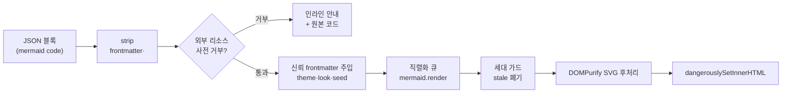

# Tutorial 0.4.0 — 잔여 블록 렌더러: 파서를 이기려 하지 말 것

이번 사이클로 블록 12종 전부가 실제 렌더러를 갖게 되어 M3가 끝났다.
구조화 카드 3종(data-model·api-endpoint·question-form)은 평범한 React
컴포넌트지만, diagram(mermaid)과 annotated-code(shiki)는 각각 굵직한
설계 문제를 하나씩 남겼다: **전역 싱글턴 라이브러리 위에 블록 단위
동시성 계약 세우기**, 그리고 **raw 문자열 검사로 파서를 이기려는 시도의
구조적 한계**. 이번 튜토리얼은 이 두 문제와, 코드 리뷰 4라운드에 걸친
보안 경계의 진화 과정을 원리부터 뜯어본다.

## 1. 렌더 파이프라인 전체 그림



wireframe(0.3.1)의 "정제 → 주입" 원칙이 그대로 재등장하되, 이번에는
정제가 **렌더 전 거부**와 **렌더 후 정화**의 샌드위치 구조다. 이유는
mermaid의 특성에 있다: 이미지 노드 같은 외부 리소스는 **렌더 과정에서**
(레이아웃 측정을 위해) 이미 로드된다. 출력 SVG를 아무리 깨끗하게 닦아도
네트워크 요청은 이미 나간 뒤다. 그래서 위험한 입력은 `mermaid.render`
호출 자체를 막아야 한다.

## 2. 보안 경계의 진화 — 정규식 4개가 전면 거부가 되기까지

이 사이클에서 가장 교훈적인 부분은 코드가 아니라 **리뷰 루프에서 경계가
세 번 뚫린 과정**이다.

| 라운드 | 방어 | 우회 |
|---|---|---|
| 1 | `img:`·`url(`·`://` 정규식 | `"img":` 인용 키, `//host` protocol-relative |
| 2 | 인용 키 패턴 + `//` 거부 | `"img"` — YAML 이중 인용 이스케이프 |
| 3 | `@{` + 백슬래시 공존 거부 | `&asset img, *asset :` — YAML anchor/alias |
| 4 | **`@{…}` 메타데이터 전면 거부** | (수렴) |

패턴이 뚫릴 때마다 패턴을 하나 더 붙이는 대응은 세 번 만에 한계가
드러났다. 근본 원인은 **비대칭성**이다: 우리는 raw 문자열을 보고,
mermaid는 완전한 YAML 파서로 해석한다. YAML에는 같은 값을 표기하는
방법이 사실상 무한하다 — 인용, 이스케이프, anchor/alias, 접기(folding).
문자열 층위에서 "해석 결과에 img 키가 있는가"를 판정하려는 것은
파서를 정규식으로 재구현하는 일이고, 항상 진짜 파서가 이긴다.

수렴한 답은 판정 층위를 옮기는 것이다:

```
위험한 값을 찾아 거부한다 (블랙리스트, 문자열 층위)   ← 지는 게임
    ↓
위험이 표현될 수 있는 채널을 통째로 닫는다 (구조 층위) ← 이긴 게임
```

`@{…}` 셰이프 메타데이터는 mermaid에서 YAML이 해석되는 유일한 잔여
채널이다(frontmatter와 `%%{init}%%`는 이미 strip). 채널을 닫으면
표기법의 무한한 변형이 전부 무의미해진다. 대가는 `A@{ shape: cylinder }`
같은 합법적 사용의 오탐인데, 두 가지 이유로 감수할 만하다:

1. 거부 시 인라인 안내와 함께 **원본 코드가 그대로 표시**되므로 정보
   손실이 없다 (실패 격리 원칙).
2. 완화는 언제든 additive로 가능하다 — 후속 사이클에서 `@{…}` 내용물을
   진짜 YAML 파서로 해석해 키 allowlist(`shape` 등)만 통과시키면 된다.
   보수적 시작 → 근거 있는 완화가 그 반대보다 항상 싸다.

이 오탐 정책 자체를 테스트로 계약화했다는 점도 눈여겨볼 만하다
(`'any shape metadata (conservative)'` 케이스). 의도된 오탐이 나중에
"버그"로 오인되어 조용히 풀리는 것을 막는다.

## 3. 전역 싱글턴 위의 동시성 계약 — 직렬화 큐와 세대 가드

mermaid의 API 형태가 두 번째 문제를 만든다:

- `mermaid.initialize(config)` — **전역** 설정. 인스턴스가 없다.
- `mermaid.render(id, code)` — 설정 인자가 **없다**.

한 문서에 diagram 블록이 여럿이고, 각 블록은 자기 seed(`handDrawnSeed`)와
현재 테마의 토큰 실값을 써야 한다. 게다가 React StrictMode는 개발 모드에서
이펙트를 이중 실행하므로 같은 블록의 렌더 두 개가 동시에 뜬다. 전역 설정을
블록마다 갈아끼우면 동시 렌더끼리 설정을 밟는다.

어댑터(`diagram-mermaid.ts`)는 세 가지 장치로 계약을 세운다:

1. **호출별 설정은 전역이 아니라 문서 안으로** — mermaid가 공식 지원하는
   YAML frontmatter를 렌더러가 **생성해서** strip된 본문 앞에 주입한다.
   `theme`·`themeVariables`·`look`·`handDrawnSeed`는 다이어그램 단위
   설정이 되고, `securityLevel` 같은 보안 키는 frontmatter로 변경
   불가능(mermaid secure 목록)하므로 전역 initialize에 한 번만 고정한다.
   신뢰 주입 채널과 보안 고정 채널이 구조적으로 분리된다.
2. **직렬화 큐** — 렌더 호출을 promise 체인으로 줄 세운다. 전역 상태를
   만지는 구간이 절대 겹치지 않으므로 "설정 밟기"가 원천 차단된다.
   `renderQueue.then(task, task)`로 앞선 실패가 큐를 멈추지 않게 한다.
3. **세대 가드** — 테마 전환은 `html.dark` 클래스 관찰(MutationObserver)로
   감지하고 세대 번호를 올린다. 렌더 완료 시점에 자기 세대가 이미 낡았으면
   결과를 **커밋하지 않고 폐기**한다. 늦게 끝난 다크 테마 SVG가 라이트
   화면에 꽂히는 시간 역전을 막는다.

DOM id는 시도마다 고유값을 새로 딴다(`renderAttempt` 증가). block.id를
그대로 쓰면 StrictMode 이중 시도가 같은 id로 충돌한다 — **스케치 seed는
블록별 결정값, DOM id는 시도별 고유값**으로 역할이 다르다는 점이 핵심이다.
wireframe의 rough.js 오버레이(0.3.1)와 같은 결정성 원칙이, 다른 메커니즘으로
반복된다.

## 4. 토큰 실값 판독 — CSS 변수를 못 먹는 테마 엔진

wireframe은 rough.js 스트로크 색을 `var(--wf-ink)` 문자열로 지정해 테마
전환 시 재그리기 없이 반전됐다. mermaid에서는 같은 트릭이 안 통한다:
mermaid 테마 엔진은 `themeVariables`로 받은 색에서 파생색(호버·보더 등)을
**계산**하므로 실제 hex 값이 필요하다. 그래서:

- 렌더 시점에 `getComputedStyle`로 `--wf-*` 실값을 읽어 전달하고,
- 테마가 바뀌면 값을 다시 읽어 **재렌더**한다 (세대 가드가 경합 정리).

여기서 파생된 함정이 "토큰이 아예 없는 문서"다. `--wf-*` 정의가
wireframe.css에만 있으면 wireframe 블록이 없는 문서에서는 lazy CSS가
로드되지 않아 `getComputedStyle`이 빈 문자열을 돌려준다. 그래서 토큰
정의를 `wireframe/tokens.css`로 추출하고 wireframe.css와 DiagramBlock이
**각자** import한다 — 번들러가 중복을 제거하므로 비용은 없고, 어느 쪽이
먼저 로드되든 토큰이 보장된다. lazy 로딩과 전역 CSS 커스텀 프로퍼티를
섞을 때 로드 경로마다 "누가 이 정의를 실어오는가"를 따져야 한다는 교훈.

## 5. shiki 공용화 — 동기 예외라는 함정

annotated-code는 diff가 이미 쓰던 shiki를 재사용한다. DiffBlock 모듈에
갇혀 있던 하이라이터 싱글턴을 `lib/highlighter.ts`로 승격하고, 임의의
`lang`을 받도록 동적 로딩을 얹었다:

```
lang 정규화 → ('text'|'diff'는 즉시) → loadLanguage 캐시 → 실패 시 'text' 폴백
```

여기서 리뷰가 잡아낸 함정: shiki 4.3.1의 `loadLanguage`는 번들에 없는
언어에서 rejected promise가 아니라 **동기 예외**를 던진다.

```ts
// 잘못된 가정 — 동기 throw는 .catch()에 도달하지 못한다
highlighter.loadLanguage(lang).then(...).catch(() => 'text');

// 수정 — 호출 자체를 promise 체인 안으로
Promise.resolve().then(() => highlighter.loadLanguage(lang))
  .then(() => lang)
  .catch(() => 'text');
```

`async function`은 동기 throw도 rejection으로 감싸주지만, 일반 함수가
promise를 반환하는 API는 그 보장이 없다. "promise를 반환하는 함수는
던지지 않는다"는 관례일 뿐 계약이 아니다 — 외부 라이브러리의 실패 경로를
방어할 때는 호출부터 체인 안에 넣는 것이 안전하다. 이 동작 차이는 추측이
아니라 node로 직접 실행해 실증한 뒤 수정했고, 테스트 목도 실제처럼 동기
throw를 하도록 맞춰 회귀를 잠갔다.

## 6. 마진 주석 — 픽셀 정렬 대신 번호 대응

annotated-code의 주석 배치는 의도적으로 "덜 정밀한" 계약을 골랐다.
코드 라인과 주석 카드를 픽셀 단위로 정렬하는 대신:

- shiki transformer가 주석 라인에 마커 클래스·앵커 id를 부여하고,
- 우측 마진(넓은 화면) 또는 하단 목록(좁은 화면)의 주석 카드가
  **표시 라인 번호**(`startLine` 오프셋 반영)로 대응하며 앵커 링크로
  점프한다.

픽셀 정렬은 폰트 로딩·줄바꿈·zoom에 취약하고, 번호 대응은 이 모든 변수에
불변이다. 시각적 화려함보다 계약의 견고함을 고른 사례로, diff의
`classifyDiffLines`처럼 대응 로직을 순수 함수(`getDisplayedLineNumber`,
`groupAnnotationsByLine`)로 분리해 jsdom 없이 검증한다.

## 7. 구조화 카드와 Grounding의 시각화

data-model·api-endpoint의 `inferred` 필드는 Grounding Rule(구조화 블록은
기계적으로 도출된 사실만)의 예외를 표시하는 장치다. 렌더러는 이를 "추론됨"
배지로 노출해 **문서를 읽는 리뷰어가 사실과 추정을 시각적으로 구분**할 수
있게 한다. 근거 컬럼은 inferred 필드가 하나라도 있을 때만 나타난다 —
전부 사실인 테이블에 "—"만 찬 컬럼을 보여주지 않는다.

question-form이 실제 폼 컨트롤 없이 목록으로만 렌더되는 것도 같은 원칙의
연장이다: 제출·포커스 경로가 아예 없으면 무력화할 것도 없다. wireframe이
sanitize 후처리로 disabled를 강제해야 했던 것과 달리, 처음부터 컨트롤을
만들지 않는 쪽이 한 층 더 단순하다.

## 8. 이 사이클이 남긴 원칙

1. **파서를 정규식으로 이기려 하지 말 것** — 해석되는 채널이 있다면 값이
   아니라 채널을 닫아라. 보수적 시작 → additive 완화.
2. **전역 싱글턴 라이브러리는 어댑터로 감싸 동시성 계약을 명시하라** —
   직렬화 큐, 시도별 id, 세대 가드. StrictMode 이중 이펙트는 이 계약의
   좋은 리트머스다.
3. **외부 API의 실패 경로는 실증하라** — 동기 throw vs rejection은
   문서가 아니라 실행으로 확인했고, 그 결과가 수정 방향을 결정했다.
4. **의도된 오탐도 테스트로 계약화하라** — 정책이 버그로 오인되어
   풀리는 것을 막는다.
