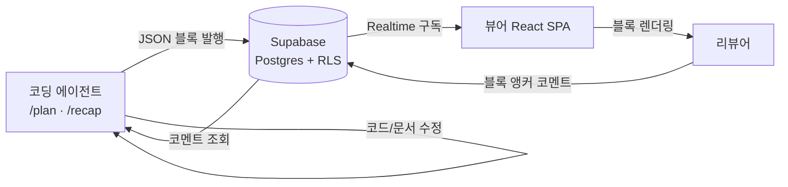

# previs Architecture Documentation

## 1. How to Read This Document

이 문서는 previs의 아키텍처 기준 문서다. 코드 구현 전 단계에서는 확정된 설계
방향을 기록하고, 구현이 진행되면 실제 코드베이스를 반영해 갱신한다.
`(예정)` 표기는 아직 코드로 존재하지 않는 확정 설계를 뜻한다.
유지보수 규칙은 [ARCHI-rules.md](ARCHI-rules.md)를 따른다.

## 2. Overview

previs(previsualization)는 코딩 에이전트의 작업 계획(plan)과 작업 회고(recap)를
사람이 검토하기 좋은 인터랙티브 비주얼 문서로 만들어주는 도구다.

- **plan** — 구현 착수 전 계획을 다이어그램·와이어프레임·파일 맵으로 시각화해
  리뷰어 승인 게이트 역할을 한다.
- **recap** — 구현 완료 후 PR/브랜치/diff를 변경의 "형태"로 요약해 raw diff
  이전의 리뷰 진입점을 제공한다.

> **현재 상태**: 사전 구현 단계. 저장소에는 규칙 문서(AGENTS.md), 디자인 시스템
> 명세(DESIGN.md), 본 문서만 존재한다.

## 3. Technology Stack

| 계층 | 기술 | 상태 |
|------|------|------|
| 뷰어 | React SPA (TypeScript) | 예정 |
| UI 프리미티브 | shadcn/ui + Tabler Icons | 예정 |
| 스타일 토큰 | DESIGN.md (MiniMax 기반) + Tailwind CSS 변수 매핑 | 명세 확정 |
| 콘텐츠 렌더링 | rough.js(손그림), mermaid(다이어그램), shiki(코드) | 예정 |
| 백엔드 | Supabase (Auth·RLS·Realtime·Storage) | 예정 |
| 에이전트 연동 | Claude Code 스킬 `/plan`, `/recap` | 예정 |
| 로컬 런처 | Node 스크립트 (싱글턴 보장) | 설계 확정 |

의존성 버전은 스캐폴딩 시 `pnpm view`로 확인 후 확정한다 (AGENTS.md 작업 규칙).

## 4. Project Structure

현재 구조:

```
previs/
├── AGENTS.md        # 프로젝트 공통 지침 (canonical source)
├── CLAUDE.md        # AGENTS.md 심볼릭 링크
├── DESIGN.md        # 뷰어 UI 디자인 시스템 명세
├── README.md
└── docs/            # TRIP 워크플로우 문서
    ├── 1-plans/     # 기능 계획 문서
    ├── 2-changelog/ # 버전 체인지로그
    ├── 3-code-review/
    ├── 4-unit-tests/
    └── 6-memo/
```

구현 단계 진입 시 모노레포(pnpm workspace) 구성을 예정하며, 확정 시 본 섹션을
갱신한다.

## 5. Core Architecture Principles

1. **콘텐츠는 JSON 블록 배열** — MDX를 쓰지 않는다. DB 저장 콘텐츠의 런타임
   코드 실행 경로를 차단하고 렌더링을 단순화한다.
2. **Grounding Rule** — 구조화 블록은 실제 변경에서 기계적으로 도출된 사실만
   담는다. 모델의 자유 서술은 산문 블록에만 허용한다.
3. **시각 계층 분리** — 뷰어 앱 UI는 DESIGN.md 토큰을, 블록 콘텐츠
   (와이어프레임·다이어그램)는 `--wf-*` 손그림 체계를 따른다. 두 체계를 섞지 않는다.
4. **백엔드 코드 최소화** — 협업 기능(코멘트·공유·실시간)은 Supabase 기본 기능
   (RLS·Realtime)으로 해결하고 커스텀 서버를 두지 않는다.
5. **로컬 프로세스 싱글턴** — 뷰어 서버는 세션당 중복 기동되지 않도록 런처가
   재사용을 보장한다.

## 6. Build System & Toolchain

- 패키지 매니저: pnpm (예정)
- TypeScript 전용 — `.js`/`.mjs` 소스 금지 (AGENTS.md)
- 빌드·lint·test 명령은 스캐폴딩 후 본 섹션과 TRIP 스킬에 반영한다.

## 7. Configuration

- Supabase 접속 정보는 환경변수로 관리한다. 시크릿 리터럴 하드코딩 금지
  (AGENTS.md 데이터 규칙).
- 런처 설정(포트·락 파일)은 프로젝트 경로 해시 기반으로 자동 유도한다.
  포트는 전용 대역 `47738~47801`을 사용한다 (§11 참조).

## 8. Components & UI Architecture (예정)

- **앱 크롬**: 문서 목록, 문서 뷰, 코멘트 패널 — shadcn/ui 프리미티브 기반,
  DESIGN.md 토큰 적용.
- **블록 렌더러**: 블록 타입별 React 컴포넌트 매핑. 최소 블록 셋:
  `prose`(산문), `wireframe`, `diagram`, `diff`, `annotated-code`,
  `data-model`, `api-endpoint`, `file-tree`, `tabs`, `columns`, `callout`,
  `question-form`.
- **문서 카드 정체성**: plan/recap 문서 카드는 DESIGN.md의 그라디언트 팔레트로
  고유 식별색을 갖는다.

## 9. Data Model & Backend (예정)

- **핵심 테이블**: documents(kind: plan|recap, 블록 JSON, 메타), comments
  (블록 앵커, 상태), profiles.
- **접근 제어**: Supabase RLS로 소유자/공유 링크/게스트 권한을 구분한다.
- **실시간**: 코멘트는 Realtime 구독으로 라이브 갱신한다.
- **파일**: 스크린샷 등 대용량 자산은 Storage에 저장하고 URL만 테이블에 남긴다.
- **마이그레이션**: additive만 허용 (AGENTS.md 데이터 규칙).

## 10. Agent Integration (예정)

- Claude Code 스킬 `/plan`, `/recap`이 JSON 블록 문서를 작성해 Supabase에
  발행한다.
- recap은 git diff에서 기계적으로 블록을 도출한다 (Grounding Rule).
- 리뷰어 코멘트는 에이전트가 조회해 코드/문서 수정에 반영한다 (피드백 루프).

## 11. Local Launcher (설계 확정)

- SessionStart 훅 기동 금지. 스킬 호출 시점에 재사용 우선으로 기동.
- `/api/viewer-info` 헬스 엔드포인트로 정체 확인 후 재사용 판단.
- 원자적 락(`fs.open(lockPath, 'wx')`)으로 동시 기동 경쟁 차단.
- 유휴 30분 자동 종료.
- **전용 포트 대역 `47738~47801`**: `47738 + (프로젝트 경로 해시 % 64)`로 유도.
  흔한 개발 포트(3000/5173/8080 등)와의 충돌·오탐을 피하기 위한 유니크 대역으로,
  잘 알려진 서비스가 없고 macOS ephemeral 대역(49152+) 밖이며 BACnet(47808)을
  피한다. 점유 시 대역 내 +1 상향 탐색, 확정 포트는 락 파일에 기록.

## 12. Data Flow Diagrams



## 13. Error Handling Strategy (예정)

- 뷰어: 낙관적 UI + 실패 시 롤백 (AGENTS.md 뷰어 UX 규칙).
- 스킬: 발행 실패 시 로컬 JSON을 보존해 재시도 가능하게 한다.

## 14. Testing Strategy (예정)

- 테스트 프레임워크·명령은 스캐폴딩 시 확정 후 본 섹션과
  [4-unit-tests/TESTING.md](4-unit-tests/TESTING.md)에 반영한다.
- 우선순위: 블록 스키마 검증 > diff→블록 도출 로직 > 렌더러 스냅샷.

## 15. Security Considerations

- diff 내 시크릿은 절대 전사하지 않고 마스킹한다 (AGENTS.md 콘텐츠 규칙).
- 콘텐츠는 JSON 블록이므로 뷰어에서 임의 코드 실행 경로가 없다.
  와이어프레임 HTML 조각은 sanitize 후 렌더링한다.
- 비공개 문서는 RLS로 접근을 통제하고 기본값은 비공개다.

## 16. Deployment (미정)

- Claude Code 플러그인 패키징은 추후 계획 (AGENTS.md).
- 뷰어 호스팅 방식(로컬 전용/배포)은 구현 단계에서 결정한다.

## 17. Conclusion

previs는 "에이전트가 쓰고 사람이 검토하는" 비주얼 문서 도구로, JSON 블록
콘텐츠 모델과 Supabase 협업 계층, 이중 시각 체계(DESIGN.md ↔ `--wf-*`)를
핵심 결정으로 삼는다. 구현 진행에 따라 `(예정)` 섹션을 실제 코드 기준으로
갱신한다.
